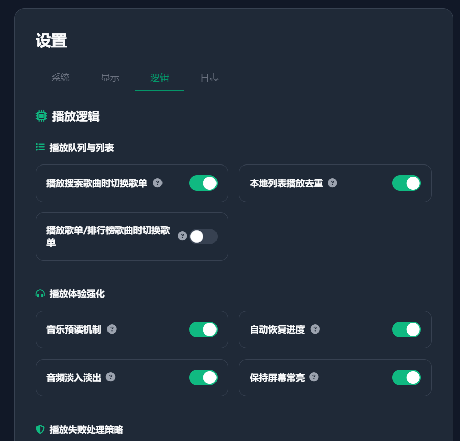
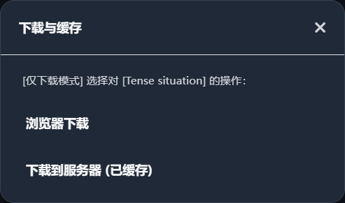

# Changelog

## v1.9.4 (2026-06-10)

### 🌟 新增功能

- **安全 VM 模式管理**:
  - **VM 模式配置**: 在系统设置的“权限与缓存限制”卡片中新增“允许 VM 模式运行脚本”开关，默认关闭，极大提升安全性。
  - **强制管理员验证**: 任何上传、导入或启用原生 VM 模式自定义源脚本的操作，都必须附带正确的管理员密码验证，彻底阻断了通过单条命令行（如 curl）进行越权上传和运行 VM 模式的攻击路径。
  - **可视化 VM 标识**: 自定义音源列表中，以原生 VM 模式运行的音源其后面会新增明显的 `VM` 标签提示，更易于管理员进行安全审计。
  - 
- **设置界面分块优化**:
  - **设置界面去英文**: 移除设置界面中多余的英文标识。
  - **分块设置布局**: 对设置界面进行合理分块排版，让选项设置更加一目了然，结构层次更明晰。
  - 
- **播放失败处理策略优先级**:
  - **策略优先级自定义**: 新增“播放失败策略优先级”设置，支持灵活配置失败处理逻辑的优先级（例如选择 `切换平台 -> 降低音质 -> 下一首`），以提供更好的自动纠错机制。
  - 
- **群晖 SPK 分发**:
  - **引入 SPK 打包子模块 (#190 @yy505149)**: 引入群晖套件打包子模块，支持群晖 SPK 套件分发。

### 🔧 修复与优化

- **仅下载模式优化 (#207)**:
  - **选项文本更新**: 仅下载模式下，单曲下载菜单选项由“缓存到服务器”改为“下载到服务器”。
  - **忽略缓存重复下载**: 在仅下载模式下，即使歌曲在 `cache` 目录中已缓存，依旧允许用户继续进入下一步选择新的音质并下载到 `/music` 目录。
  - 
- **系统安全与路径过滤**:
  - **防路径穿越 (#223 @sebastiondev)**: 修复了 elFinder 文件管理器中 `decode()` 方法的路径穿越风险，防止未授权访问或读取系统文件。
- **文件存储安全与健壮性**:
  - **安全重命名回退 (#226 @bobcc4)**: 修复了 fileCache 部分场景下的移动与命名安全问题，引入了安全命名回退和调试日志，并确保目标路径目录存在。
- **本地歌曲与缓存性能优化 (#186)**:
  - **歌曲封面缓存机制**: 在服务端引入封面缓存。提取音频文件的 ID3 封面时，计算文件名 MD5 并将图片数据与 MIME 类型缓存至 `cover_cache` 目录。后续请求直接读取缓存文件，彻底避免了重复读取并解析大音频文件标签的高开销操作，同时在删除歌曲缓存时自动清理关联封面缓存。
  - **异步扫描与事件循环让渡**: 将本地歌曲扫描（`syncCacheIndex`）的递归文件遍历改写为异步 I/O 模式（使用 `fs.promises`），并在遍历循环中加入 `setImmediate` 机制主动释放/让渡 Node.js 事件循环，避免了超大音乐库扫描时导致的服务器主线程阻塞，保证了高并发下的服务响应速度。
  - **客户端浏览器缓存优化**: 移除了本地音乐及缓存列表中封面图 URL 携带的 `&t=Date.now()` 时间戳，允许浏览器正常对封面图片进行强缓存，显著降低了重复的 HTTP 缓存请求开销，使歌曲列表页面加载和滚动渲染更加丝滑。
- **前端样式重构**:
  - **暗色模式适配**: 为部分内容适配不同的系统主题配色并保障对比度。
  - **样式提取与分离**: 将 `index.html` 头部 `<style>` 样式块提取并搬移到了独立的外部样式表 `app.css` 中，大幅缩减了主页面的 HTML 体积，便于后续样式的独立维护。
  - **歌曲重映射(#199,#195)**: 本地音乐面板新增“歌曲重映射”功能按钮，激活后可以针对已关联好的歌曲显示手动关联/重新关联按钮，提升本地音乐与云端数据的映射灵活度。

## v1.9.3 (2026-05-06)

### 🌟 新增功能

- **本地音乐子目录管理 (Categorization) (#150)**:
  - **分类文件夹**: 支持在 `/data/music` 或 `/music` 目录中创建多级子目录，实现本地音乐的物理分类管理（注意：`cache` 文件夹暂不支持创建子目录）。
  - **批量分类**: 批量操作栏新增“分类”功能，支持一键将选中的音乐及其关联歌词文件移动到目标文件夹，并自动同步索引。
  - **路径自动识别**: 优化扫描逻辑，支持深度递归搜索，自动识别并记录歌曲的 `subPath` 物理路径。
  -  
- **搜索与分页增强 (#151)**:
  - **自动回弹**: 切换搜索分页时自动滚动回列表顶部。
  - **跳转功能**: 分页控件新增“跳转至指定页”功能。
- **登录状态查看与快捷入口 (#162)**: 增加登录状态查看面板及快捷操作入口。
- **歌曲歌词嵌入功能 (#163)**: 支持将歌词内容嵌入到歌曲文件的元数据标签中，方便本地文件管理。
  -  
- **筛选多选功能**: 筛选面板支持多项选择，极大提升了歌曲过滤的灵活性。
  - 

### 🔧 修复与优化

- **系统存储升级 (#160)**: 引入 **IndexedDB** 替代 LocalStorage 存储核心列表数据，彻底解决了大规模歌单场景下 5MB 储存空间不足的问题。
- **播放与下载逻辑修复 (#164, #167)**:
  - **浏览器下载修复**: 修复了存在缓存歌曲后，无法使用浏览器下载的问题。
  - **播放器接入修复**: 修复了部分情况下无法正常进入网页播放器的问题。
- **播放器交互**:
  - **语境切换修复**: 修复了播放搜索列表歌曲时，在开启“切换播放语境”设置的情况下仍会错误意外触发重置到默认歌单的 Bug。
- **UI 与体验**:
  - **移动端深度优化**: 优化了手机端部分弹出面板的触摸交互与布局表现。
  - **界面展示优化**: 进一步优化了部分 UI 组件的视觉表现。

## v1.9.2 (2026-04-27)

### 🌟 新增功能

- **搜索体验优化 (#143, #144)**:
  - **步长调整**: 搜索歌曲的分页加载步长从一次请求多页调整为单页步长（Step = 1）。
  - **预连接拉取**: 新增后台预拉取机制，当触及当前列表末尾时自动拉取后续页码，实现无缝滚动体验。

### 🔧 修复与优化

- **音源兼容性**:
  - **播放代理优化 (#139)**: 修复了部分歌曲由于 CORS 限制无法播放的问题，现在支持自动检测 CORS 状态并智能开启音频中转代理。
  - **酷我封面画质**: 整体提升酷我音源的封面分辨率，从默认的低画质统一升级至 **1000x1000** 高清版本。
- **系统核心**:
  - **缓存机制修复 (#147)**: 修复了某些经代理重写的最终播放链接传递到后端时，由于 URL 校验问题导致服务器端缓存失败的问题。
  - **本地歌词播放 (#149)**: 优化并修复了本地缓存/导入歌词在离线或特定网络环境下的播放显示问题。
- **第三方协议**:
  - **Subsonic 协议适配 (#141)**: 增强了 Subsonic 接口的数据返回，支持获取并展示专辑的发行年份。

## v1.9.1 (2026-04-22)

### 🌟 新增功能

- **本地歌曲管理 (#114)**:
  - **多目录扫描**: 支持管理 `/cache`、`/music`、`/data/cache` 及 `/data/music` 目录下的所有本地音乐文件。
  - **自动特征刮削**: 内置 **Acoustid** 与 **Chromaprint** 指纹识别引擎，支持对外部导入的无标签音乐进行全自动音乐特征识别与刮削。
  - **元数据补全**: 支持手动刮削、补全歌词、补全封面以及完善歌曲 ID3 标签信息（歌手、专辑等）。
  - **本地搜索与播放**: 完美集成到播放器中，支持将本地扫描到的歌曲作为歌单列表进行搜索、筛选及循环播放。
  - 
- **下载与缓存优化 (#124)**:
  - **自定义文件名**: 在“仅下载模式”或执行服务器缓存时，新增支持自定义文件名命名规则，满足用户对本地库文件命名的个性化需求。
  - 

### 🔧 修复与优化

- **播放器核心**:
  - **歌单导入修复 (#100, #125)**: 修复了从第三方平台导入部分特定格式歌单时，歌曲由于 ID 映射问题导致无法正常解析播放的问题。
  - **自定义路径修复 (#122)**: 修复了在应用设置中将播放器 URL 路径自定义为根路径 `/` 时，导致资源加载 404 或重定向循环的问题。

## v1.9.0 (2026-04-18)

### 🌟 新增功能

- **搜索与发现**:
  - **歌手/专辑搜索 (#95)**: 新增搜索歌手和专辑功能，支持从 QQ 音乐和网易云音乐两大平台深度检索相关内容。
  - 
  - **支持收藏歌手和专辑**: 全面支持对歌手和专辑进行收藏/星标操作，方便用户构建个人音乐库。
  - 
  - **QQ 号歌单导入 (#110)**: 新增支持通过 QQ 号直接导入公开歌单功能，极大方便了歌单迁移与快速收藏。
  - 
- **系统集成**:
  - **Subsonic 功能深度适配**: 适配 Subsonic 协议的大部分核心功能，进一步提升与第三方客户端的兼容性。
  -  
  -  
- **管理与限制**:
  - **公开音源列表隐藏**: 开启“公开用户限制”后，针对未验证的公开用户将自动隐藏自定义源列表，进一步增强服务器隐私与安全性。
  - 
  - **歌手信息源优先级**: 支持在后台管理界面灵活配置Subsonic歌手详情、头像及简介的获取来源优先级（支持 TX 与 WY 平台）。
  - **用户缓存深度限制 (#112)**:
    - **管理员监控**: 为管理员新增用户缓存限制开关。开启后可限制非管理员用户仅能使用核心三项功能（同步、歌词、播放）及“仅下载模式”，确保系统稳定性。
    - **空间配额统计**: 统一统计每个用户在 `data/cache` (同步) 与 `cache` (非同步) 目录下的总资产体积。
    - **智能 LRU 清理机制**: 当检测到用户缓存超出设定的空间限制时，系统将按文件修改时间 (mtime) 执行从旧到新的覆盖删除，直至容量回落到限制值的 95% 以内。
    - 
  - **修改用户名 (#117)**: 支持用户在管理界面自定义更改登录用户名，增强用户管理的灵活性。
  - 
- **界面交互**:
  - **音乐平台记忆功能 (#97)**: 增加音乐平台选择缓存功能。现在系统会自动记住用户上次选中的音乐平台（如网易/QQ），下次刷新网页时将自动恢复选择。

### 🔧 修复与优化

- **系统与安全**:
  - **用户密码持久化修复 (#103)**: 修复了在用户管理界面刷新列表时会错误重载配置，导致用户密码被意外恢复为默认值的问题。
  - **自定义路径安装修复 (#108)**: 修复了在支持自定义路径配置后，应用安装过程中可能出现的路径识别与部署问题。
- **存储与下载**:
  - **文件类型精确识别 (#105)**: 修复了下载歌曲后缀名可能不准确的问题。引入了 `file-type` 库进行二进制文件头检测，确保下载文件的扩展名与其实际内容严格匹配。
- **后台管理**:
  - **排序背景色显示优化 (#98)**: 修复了管理后台“数据查看”模块中，所有歌曲列表在执行排序操作时背景总是显示为白色的视觉问题。

## v1.8.4 (2026-04-12)

### 🌟 新增功能

- **界面交互**:
  - **歌单折叠功能**: 新增歌单详情页头部折叠功能，点击标题可展开/收起详细描述，优化列表空间利用。
  - 
- **系统集成**:
  - **Subsonic 协议支持**: 完美支持 Subsonic 系列协议，可配合各类第三方客户端连接服务器进行音乐播放与管理。
  - 
  - **SMTC 显示歌词 (#85)**: 增加系统媒体传输控件 (SMTC) 显示歌词选项。开启后，在 Windows 系统媒体控制中心可直接同步查看当前歌词。
  - 
- **后端管理**:
  - **管理界面完全重构**: 针对后端 UI 进行了重构与深度优化，视觉更现代，交互更流畅。
  -  
  -  
  - **自定义入口功能 (#79)**: 后端增加自定义入口设置，允许通过指定路径访问服务端。
  - **仅下载模式**: 后端新增仅下载模式支持。开启后，歌曲及歌词将优先存储于 `/music` 目录，并采用 `{歌名} - {歌手} - {音质}` 的简洁命名格式，同时增强了对新旧两种格式的兼容检索与去重逻辑。
  - 
- **镜像分发**:
  - **Docker 多架构支持**: 新增对 32 位 (`arm/v7`, `386`) 架构的 Docker 镜像支持。

### 🔧 修复与优化

- **移动端适配**:
  - **歌曲操作面板冲突修复（#83）**: 修复了手机端歌曲操作面板弹出时与歌曲标题显示的冲突问题。
  - 
- **显示与交互**:
  - **侧边栏封面遮挡修复 (#91)**: 修复了左侧歌曲封面在预览时遮挡大部分功能模块的问题。
  - 
  - **联想区域关闭逻辑 (#89)**: 修复了在搜索后联想词区域未能正常关闭的问题，优化搜索过程的流畅度。

## v1.8.3 (2026-04-06)

### 🌟 新增功能

- **代理设置增强**:
  - **自定义播放代理 (#74)**: 新增播放音乐自定义代理设置，允许用户指定特定的代理服务器进行音频流中转。
  - 
  - **MusicSDK 代理**: 增加 MusicSDK 代理设置，支持热搜、歌单、排行榜等元数据获取通过代理中转，提升在特殊网络环境下的访问稳定性。
  - 
- **播放器功能**:
  - **批量收藏 (#68)**: 列表操作新增批量收藏功能，支持一次性将多首歌曲添加到收藏夹。
  - 

### 🔧 修复与优化

- **性能与稳定性**:
  - **CPU 占用优化 (#72)**: 针对 WebDAV 同步及文件缓存逻辑进行了深度优化，有效降低了服务器在高负载下的 CPU 占用。
  - **缓存报错修复 (#65, #76)**: 修复了部分情况下出现的“服务器拒绝缓存”错误，提升了缓存成功率。
  - **iOS 后台播放 (#73)**: 进一步优化了 iOS 设备在后台播放时的稳定性，解决部分场景下的中断问题。
- **界面显示**:
  - **后端 UI 优化**: 优化了后端管理控制台的 UI 细节显示，提升了视觉一致性与操作体验。
  - 
  - **平板竖屏适配**: 安卓与ipad平板竖屏UI适配

## v1.8.2 (2026-04-03)

### 🌟 新增功能

- **安全与授权**:
  - **Token 管理**: 新增 Token 管理面板。用户可以生成具有自定义名称和过期时间的永久/长期访问 Token，供第三方应用或自动化脚本安全调用服务器 API。
  - 
  - **接口权限增强**: 全面增强了后端 API 接口的安全性，支持通过 `X-User-Token` 进行持久化状态验证。
- **客户端模式**:
  - **客户端模式**: 支持每次登陆本地账户都会模拟客户端向远程服务器发起同步请求
  - 
  - 

### 🔧 修复与优化

- **播放体验**:
  - **iOS 后台播放 (#61)**: 修复了 iOS 设备在锁屏或浏览器切到后台时音频自动暂停的问题，显著提升了移动端收听的稳定性。
- **系统底层**:
  - **存储路径修复 (#62)**: 修复了缓存目录问题。
  - **性能优化**:
    - **网页加载提速**: 进一步优化了前端资源加载逻辑，网页首屏加载速度显著提升。
- **界面显示**:
  - 修复部分模态框样式问题。

## v1.8.1 (2026-04-01)

### 🌟 新增功能

- **打包与分发**:
  - **多平台客户端**: 完成了 Windows、macOS 和 Linux 三个主流平台的桌面客户端打包。现在支持在各大平台下载并使用本地客户端。

### 🔧 修复与优化

- **UI 体验**:
  - 优化了前端播放器及后端管理控制台的部分 UI 交互与视觉表现。
  - 修复了排行榜底部布局阴影及圆角显示不一致的问题。
- **系统更新**:
  - 修复了检查更新时，发布日志或版本信息显示异常的问题，确保能获取到最新的更新详情。

## v1.8.0 (2026-03-25)

### 🌟 新增功能

- **Web 播放器**:
  - **音乐排行榜**: 集成了多平台（网易云、QQ音乐、酷狗、酷我、咪咕）排行榜数据。
  - 
  - **键盘快捷键增强**: 新增点击 **H** 快速开关服务器缓存面板，点击 **J** 快速开关下载管理面板，并同步更新了设置页面的快捷键 UI 说明。

### 🔧 修复与优化

- **Web 播放器**:
  - **WebSocket 同步优化**: 修复了 WebPlayer 作为客户端连接其他服务端或桌面端时，同步模式选择面板（"覆盖" / "合并" 等）的选择意图未能正确应用视角的反转映射（`TRANS_MODE`），导致服务端执行了相反的数据覆盖操作的问题。
  - **同步状态持久化修复**: 解决了连入远程端后页面刷新，由于未读取已有 `authInfo` 引发重新配对其生成新客户端标识 `clientId` 的问题。现在服务端能成功识别刷新重连的设备，自动匹配并触发 MD5 数据层比对，消除了重复弹出的数据同步确认弹窗。
  - **歌词缓存接口修复**: 修复了歌词获取与缓存接口（`/api/music/lyric` 及 `/api/music/cache/lyric` 等）对不同版本客户端传参（如 `songmid`, `songId`, `id`）的向下兼容问题，并新增了对带有音源前缀（如 `tx_...`）ID 的自动去前缀处理。解决了因歌词解析下载失败、缓存查询报 400 缺失等问题。

## v1.7.7 (2026-03-18)

### 🌟 新增功能

- **Web 播放器**:
  - **公开用户权限管理**: 新增 `user.enablePublicRestriction` 配置选项。开启后（默认开启），针对未登录的公开用户（`_open` 账号），将限制其上传自定义源、删除共享源以及修改系统配置（缓存歌曲文件、缓存歌词文件、缓存歌曲位置）。当公开用户尝试操作受限功能时，系统会弹出验证框，要求输入管理员密码获取权限。
  - **公开用户云端配置隔离**: 针对 `_open` 用户，将其关键缓存设置（缓存歌曲文件、缓存歌词文件、缓存歌曲位置）作为管理员级配置直接写入 `_open/settings.json` 并同步至云端。作为公开用户统一规则。

### 🔧 修复与优化

- **界面优化**:
  - 优化了手机端自定义源 UI 布局，使其更加紧凑和美观。
  - 修复侧边阴影问题
  - 修复自定义源管理（#custom-source-modal）被播放器栏（#player-footer）遮挡的问题

## v1.7.6 (2026-03-15)

### 🌟 新增功能

- **Web 播放器**:

  - **服务器缓存音质选择**: 在播放控制栏及列表操作菜单点击“缓存到服务器”时，新增音质选择面板，允许用户手动指定要拉取并缓存的音质版本。(#39)
  - 
  - **优先高质量缓存播放**: 在开启“优先播放本地缓存”功能时，如果服务器端存在同一首歌曲的多个音质缓存，播放器现在会智能识别并优先选用最高音质的版本进行播放（优先级：Hi-Res > 无损 > 高品质 > 标准）。
  - **缓存歌词**: 在缓存歌曲时，如果开启 `缓存歌词文件 (Cache Lyric File)`，系统会自动将歌曲歌词文件缓存到服务器本地。会在下次无浏览器缓存时解析本地歌词文件。
  - 
  - **歌词下载**：可以在缓存管理界面手动下载歌词文件。绿色LRC代表有对应歌词文件。
  - 
  - **下载管理面板**：可以查看本地下载和云端下载的进度，批量进行暂停，删除，可查看实时下载进度等功能。若开启 `缓存歌词文件 (Cache Lyric File)`，则会同时下载歌词。
  - 
- **管理控制台**:

  - **访问日志**：可以查看访问日志，包括访问的时间，访问的IP等信息。账号登陆，player登陆，Admin登陆等操作都会被记录。
  - 

### ⚠️ 破坏性更新 (Breaking Change)

- **缓存系统底层重构**:
  - 废弃了旧版以单横线 `-` 作为缓存文件命名定界符的规则，启用全新的安全防碰撞定界符 `_-_`。
  - **影响**：此更新从根本上解决了因歌曲名或歌手名自带横线导致系统解析信息严重错位乱码的问题。
  - **注意**：为保障解析严谨性，**新系统不再兼容读取旧版本规则生成的缓存文件**。旧版缓存文件将不会再显示在管理列表中（如需使用请重新下载或在后台手动清理）。

### 🔧 修复与优化

- **服务端**:
  - **缓存文件精确匹配修复**: 修复了下载特定音质（例如 128k）时，若服务器已存在其他音质（例如 320k），会被误判为“已存在缓存”而拒绝拉取的问题。
  - **若干小问题修复**：lazy加载照片问题，ui刷新问题，手机端适配等等

## v1.7.5 (2026-03-13)

### 🌟 新增功能

- **缓存与下载**:
  - **歌曲缓存增强**: 底部播放控制栏及列表操作菜单中新增“缓存歌曲”按钮，支持一键将在线歌曲抓取并存储至服务器本地。(#36)
  - 
  - 
  - **优先播放缓存**: 在“设置”->“播放逻辑”中新增“优先播放本地缓存”开关。开启后，播放器将优先检索服务器是否存在该歌曲的完整缓存文件。
  - 
  - **缓存管理面板**: 新增独立的缓存管理界面，支持查看已缓存歌曲列表、空间占用情况，并提供批量删除、打开目录等管理功能。
  - 
  - **元数据自动嵌入**: 缓存歌曲时，系统会自动将歌曲封面图、歌手、专辑等信息嵌入到存储的文件中，确保文件信息的完整性。
- **播放逻辑与自动化**:
  - **网络歌单自动更新**: 在“设置”->“歌单设置”中新增“自动更新收藏的网络歌单”开关。开启后，系统将定时拉取第三方平台歌单的最新数据。(#38)
  - 
  - **自动切换源匹配**: 引入了音源自动切换逻辑。当当前音源解析失败或无版权时，系统将根据歌曲特征自动搜寻并匹配其他可用源进行播放。(#37)
  - 
- **UI 与交互**:
  - **列表定位功能**: 播放详情页增加“定位到当前列表”按钮。点击后可快速跳转至歌曲所在的列表位置并执行高亮定位。
  - 

### 🔧 修复与优化

- **交互逻辑**:
  - **导航状态重置**: 修复了在切换 Tab 或列表时，批量操作工具栏及局部搜索框状态被错误继承的问题。现在所有导航操作都会自动重置二级 UI 状态。
  - **移动端搜索栏优化**: 优化了局部搜索栏在手机端的显示效果。通过缩短搜索框并采用更紧凑的上下结构排版，确保所有控件在单行内整齐显示。
- **系统底层**:
  - **逻辑重构与清理**: 清理了 `app.js` 中的冗余代码，删除过时函数，优化了整体执行效率。
  - **修复若干已知小问题**: 包含了对多个已知 UI 细节和网络请求容错性的改进。

## v1.7.4 (2026-03-10)

### 🌟 新增功能

- **服务端 & 配置**:
  - **WebDAV 配置持久化**: 现在通过 Web UI 修改的 WebDAV 相关设置（URL、用户名、密码、同步间隔）会自动保存到根目录的 `config.js` 中，解决了重启服务器后 WebDAV 配置丢失的问题。(#35)
  - **config.js 云端同步**: `config.js` 现在已纳入 WebDAV 同步监控范围。任何配置更改都会自动同步到云端的 `/lx-sync/` 目录，并在创建备份快照时自动打包。
- **Web 播放器**:
  - **播放状态显示优化**: 优化了切歌及缓冲时的状态显示逻辑，现在缓冲中会即时反馈“缓冲歌曲中...”状态，提供更好的交互体验。
  - **搜索联想提示**: 现在在搜索框输入时，系统会根据当前选择的音乐源（聚合了酷我、酷狗、网易、QQ、咪咕等平台建议）实时弹出搜索建议词。支持通过键盘上下键选择及回车确认。
  - 
  - **自动填充清理**: 拦截现代浏览器（如 Chrome）在搜索框强制弹出账号密码填充的行为。
  - **预读缓存**: 播放器在切换下一曲时能跳过解析等待，直接播放缓存的歌曲，提升了播放体验。
  - **预读显示优化**: 自动或手动切换到一首已经“预读”成功的歌曲时，能看到一条最终确定的解析状态提示。

### 🔧 修复与优化

- **服务端**:
  - **同步恢复实时生效**: 优化了从 WebDAV 恢复数据的逻辑。现在恢复 `config.js` 后，服务端会自动执行**热重载**，立即应用新配置（如新的端口、密码等），无需人工重启进程。
  - **自定义源自动重连**: 解决了 WebDAV 恢复数据后自定义源（Custom Source）显示为加载中或失效的问题。现在同步完成后会自动触发 `initUserApis`，确保云端回传的音源脚本立即进入就绪状态。

## v1.7.3 (2026-03-08)

### 🌟 新增功能

- **Web 播放器**:
  - **播放列表视觉增强**: 播放列表、单曲搜索结果及待播序列现在会同步显示**来源平台**（QQ、网易等）和**音质品质**（HQ、SQ、HR）标签。
  - **音源错误回显优化**: 音源返回的错误信息现在会明确标记“音源日志”前缀，方便快速排查是否为远程解析接口异常。

### 🔧 修复与优化

- **Web 播放器**:
  - **预读机制对齐**: 重构了音乐预读器逻辑。预读现在与实际播放共用一套 `resolveSongUrl` 核心，支持**静默后台降级**（如 320k 解析失败自动尝试 128k）。
  - **自动探测跳过**: 预读器现在具备“探路”能力。如果下一首歌曲被探测为所有音质均不可解析，系统将自动将其标记为不可用。当播放切换到该歌曲时，播放器将实现**静默秒跳**，直接尝试下一首有效资源，消除了以往切歌时的报错卡顿感。
  - **逻辑与日志清理**: 移除了播放流程中多处冗余的 URL 获取逻辑和过时的调试日志，合并了重复的函数定义，显著提升了 `app.js` 的可维护性。
  - **UI 反馈统一**: 统一了所有 Toast 提示的显示时长（2秒），删除了预读过程中的干扰性提示，营造更纯净的收听环境。
  - **设置提示语简化**: 统一了设置页面的 Tooltip 样式，将冗长的说明文字移动到以“问号”图标触发的悬浮提示中，保持界面清爽。。

## v1.7.2 (2026-03-06)

### 🌟 新增功能

- **Web 播放器**:
  - **即时预读机制 (Immediate Pre-fetching)**: 引入了全新的音乐预加载技术。当当前歌曲开始播放时，系统会自动在后台异步抓取下一首歌曲的播放链接，提升了移动端在后台运行时的播放连续性。 在“设置”->“播放逻辑”中新增了“音乐预读机制”开关（默认开启）。

### 🔧 修复与优化

- **Web 播放器**:
  - **Service Worker 音频拦截**: 增强了 Service Worker 对音频流的拦截与缓存策略，抵御后台进程被系统挂起或网络波动导致的断播。
  - **播放逻辑重构**: 抽象并统一了 URL 获取链路（服务器缓存 -> 浏览器链接缓存 -> 实时解析 -> HTTPS 代理包装），优化了错误重试机制与降级逻辑，使播放过程更为健壮。
  - **本地文件缓存匹配优化**: 优化了服务器端歌曲缓存的命中逻辑。
  - **自定义音源导入修复**: 修复并支持了自定义源导入过程中的链接重定向处理，删除上传http链接强制检测js后缀，修复上传音源中文文件名URL编码保存问题。此改进不影响以前存储的缓存文件。
  - **网易云音乐搜索接口更新**: 同步修改网易云音乐搜索接口，从 `cloudsearch` 切换到新的搜索接口 `/api/search/song/list/page`。

<br>

## v1.7.1 (2026-03-02)

### 🌟 新增功能

- **Web 播放器**:
  - **多歌手搜索优化**: 现在点击包含多个歌手的歌曲名/歌手名时，系统会自动识别并弹出选择面板，支持精准选择特定歌手进行搜索。(#30)
  - **音效预设管理增强**: 为自定义均衡器预设增加了操作按钮。现在支持直接在界面上对已保存的自定义配置进行**重命名**或**删除**。(#31)

### 🔧 修复与优化

- **Web 播放器**:
  - **音效激活状态逻辑**: 修复了当手动添加的配置与默认预设 EQ 数值完全相同时，多个预设会同时高亮显示为“正在应用”的 Bug，现在采用名称精确追踪。(#32)
  - **播放页交互动态提示**: 优化了详情页封面切换提示。桌面端改为“双击空白区域隐藏显示封面”，手机端则保持点击歌曲标题隐藏封面逻辑。(#29)
  - **评论区背景可读性**: 移除了评论弹窗的半透明和模糊效果，提升了在复杂背景下的文字阅读体验。(#28)

<br>

## v1.7.0 (2026-03-01)

### 🌟 新增功能

- **Web 播放器**:
  - **均衡器与音效调节**: 引入了功能强大的音频处理中心。支持 10 段专业均衡器（31Hz - 16kHz）调节及多种风格预设（流行、摇滚、人声、电子等）。此外还集成了环境混响特效（大厅、影院、教堂等）、音调平滑升降调节以及 3D 立体环绕声效果，提供更丰富的听觉体验。(#23)
  - 
  - **歌曲标题/歌手跳转搜索**: 优化了交互链路。现在点击播放控制栏或歌词详情页中的歌曲标题或歌手名，将一键跳转至搜索页面并自动执行搜索，极大提升了歌曲切换与探索的便捷性。(#22)
  - 

### 🔧 修复与优化

- **Web 播放器**:
  - **设置同步一致性**: 修复了代理设置、分页显示数量、热搜限制、歌词字体及公开源切换等部分设置项在同步到服务器文件时失效的问题。(#27)

<br>

## v1.6.2 (2026-02-28)

### 🌟 新增功能

- **Web 播放器**:
  - **保存设置到文件**: 新增将应用设置同步保存到服务器文件的功能。登录状态下开启此功能后，所有偏好设置（音质、外观、逻辑等）将实时同步到用户配置目录下的 `settings.json`。支持跨设备、清空缓存后的设置自动恢复。
  - 
  - **数据同步登出**: 在数据同步面板中增加了“退出登录”按钮。支持一键断开同步连接并清除本地存储的登录凭证及同步列表数据，提升多账号切换的便利性与安全性。
  - 

### 🔧 修复与优化

- **Web 播放器**:
  - **重置逻辑统一**: 合并并重构了“恢复默认设置”与“重置所有设置”的逻辑。现在重置操作会同步清理内存、本地存储及（若已开启同步）服务器端的设置文件。

<br>

## v1.6.1 (2026-02-27)

### 🌟 新增功能

- **Web 播放器**:
  - **弹窗视觉重构**: 对 `showInput` 和 `showSelect`（确认框/输入框）进行了视觉重构。移除了半透明毛玻璃背景。
  - **主题色深度适配**: 优化了所有模态框的主题色映射逻辑，无论是在深色模式还是各种彩色主题下，标题栏、按钮悬停及图标均能精准跟随系统配色。

### 🔧 修复与优化

- **Web 播放器**:
  - **跨域资源加载修复**: 彻底解决了由于 **CORS (跨域资源共享)** 限制导致的音乐等源图片封面在“歌词卡片”中无法显示的问题。

<br>

## v1.6.0 (2026-02-26)

### 🌟 新增功能

- **Web 播放器**:
  - **歌单功能支持**: 增加了对外部歌单的全面支持。用户现在可以浏览推荐歌单、排行榜，并支持歌单搜索与收藏。
  - 
  - **自定义歌单链接解析**: 支持直接粘贴并解析来自各大音乐平台（如网易云、QQ音乐、酷狗等）的自定义歌单链接，实现快速导入。
  - 
  - **正在播放列表**: 新增查看“当前播放列表”功能，支持显示待播序列、实时跳转播放及列表快捷清理。
  - 
  - **界面与交互优化**: 替换了绝大部分原生 `alert()` 和确认对话框，采用统一视觉风格的拟物化自定义模态框，操作反馈更优雅。

### 🔧 修复与优化

- **Web 播放器**:**失败制动下一曲**: 新增播放失败自动跳转逻辑。开启后，若当前歌曲解析或播放失败，系统将在 3s 后自动尝试播放下一首（默认开启）。

  

  **用户状态持久化**: 修复了删除歌曲后由于数据同步导致 `currentListData` 被覆盖，从而丢失 `username` 标识，引起自定义源列表回退到“未登录”公用状态的问题。

  **同步逻辑增强**: 优化了前端数据同步 (`setData`) 以及删除操作后的刷新逻辑，确保手动关联的用户状态在数据更新时能被正确保留和恢复。

  **UI界面优化**：修复若干UI问题

<br>

## v1.5.5 (2026-02-23)

### 🌟 新增功能

- **Web 播放器**:
  - **自动精简控制栏**: 针对手机端播放进行了深度优化，适配小屏设备，播放时可根据屏幕空间自动精简播放控制栏目，提升视觉沉浸感。
  - 
  - **歌词页面背景自定义**: 新增歌词页面背景自定义功能，支持纯色/专辑封面高斯模糊两种模式。
  - 

### 🔧 修复与优化

- **Web 播放器**:
  - **移动端 UI 适配**: 修复并优化了诸多手机与电脑播放页面的 UI 显示问题，优化了界面布局，界面利用率更高。
  - **缓存失效修复**: 修复了过期缓存链接在重新获取播放时可能失败的问题，增强了播放的稳定性。

<br>

## v1.5.4 (2026-02-22)

### 🌟 新增功能

- **Web 播放器**:
  - **暗夜模式**: 新增加暗夜模式。
  - 
  - **自动代理**: 针对https网页播放http链接歌曲的混合内容导致无法播放问题增加自动代理功能。
  - 
  - **保持屏幕常亮 (Keep Screen Awake)**: 播放时自动阻止屏幕休眠，解决移动端(iOS/Safari等)息屏断播问题。
  - 
  - **自定义源多重隔离与容错控制**:
    - **同源私有覆盖强化**: 当公开源和私有源存在相同 ID 时，系统将绝对以私有源及其启禁状态为准，切断向下越级调用公共源的路径。
    - **公开源按需启禁**: 普通登录用户不仅可以启用/禁用私有源，现在对“公开源”的操作也会生成私人偏好 (`states.json`)，仅对自身生效，多用户之间操作互不干扰。
    - **混合源绝对方位保存**: 自定义排序现已支持公开源与私有源穿插混合，拖拽后保存的排位不仅遵循“已启用 > 已禁用”的最高优先级，且具备智能容错能力，万一公开源被管理员删除也不会打乱登陆账户排序。

### 🔧 修复与优化

- **Web 播放器**:
  - **显示逻辑**: 修复部分 UI 风格和显示逻辑。
  - **收藏列表**: 删除“我的收藏”列表中专辑显示。

<br>

## v1.5.3 (2026-02-21)

### 🌟 新增功能

- **Web 播放器**:
  - **自定义源排序**: 增加对自定义源功能的自由拖拽排序支持，播放器会严格按照用户的自定义排序依次执行解析；且“启用”的源会自动排在“未启用”源之上。
  - 

### 🔧 修复与优化

- **Web 播放器**:
  - **解析详情提示更清晰**: 优化了歌曲解析失败或无源时的 Toast 提示，展示更为细致具体的各音源错误详情，帮助用户更轻松地定位问题。
  - **VM 模式脚本加载修复**: 修复并增强了部分原生 VM 模式加载经过混淆自定义 JS 脚本时的执行环境包裹问题，切断内存泄露途径解决兼容报错。

<br>

## v1.5.2 (2026-02-20)

### 🌟 新增功能

- **Web 播放器**:
  - **逐字歌词支持 (Karaoke Lyrics)**: 新增逐字级别的动效支持，歌词能够随进度平滑扫过。同时支持翻译与罗马音的同步扫过效果。
  - **歌词荧光效果 (Lyric Glow)**: 新增开关，支持控制歌词点亮时的荧光氛围感。
  - 

### 🔧 修复与优化

- **Web 播放器**:
  - **交互逻辑**: 修复点击歌词强行切换播放状态的问题，优化了非逐字歌词的点亮效果及部分样式残留问题。

<br>

## v1.5.1 (2026-02-19)

### 🌟 新增功能

- **歌词卡片分享 (Lyric Card Share)**:

  - **精美分享**: 支持将当前播放的歌曲歌词生成精美的卡片图片进行分享。
  - **高度自定义**: 支持自定义背景（纯色/专辑封面高斯模糊）、布局（竖版/横版/方形）、字体、颜色主题及歌词行数等。
  - 
- **服务端认证系统(Auth)**:

  - **核心重构**: 将 Web 播放器的认证机制从单纯的前端遮罩升级为**服务端中间件保护**。
  - **Session 管理**: 引入了基于内存的 Session 存储及 `HttpOnly` Cookie 机制，有效防止通过开发者工具（F12）篡改 DOM 来绕过登录。 现在 `/music` 路由下的所有静态页面以及相关的 API 端点 (`/api/music/*`) 均受到服务端强制认证保护。 新增了 `/music/login` 页面， 播放器头部新增“登出”按钮，支持一键销毁服务端 Session 并安全退出。
- **用户特定歌曲缓存 (User-Specific Cache)**:

  - **多用户隔离**: 重构了服务器端歌曲缓存逻辑。现在歌曲将根据当前登录用户名存储在独立的子文件夹中（如 `/cache/admin/`），未登录用户则统一存储在 `/cache/_open/` 文件夹中。
  - **权限隔离的清理与统计**: 设置中的“清除所有缓存”和“查看缓存统计”功能现在仅作用于当前用户自己的文件夹。这意味着用户 A 执行清理操作不会影响用户 B 已缓存的歌曲，确保了多用户环境下的数据安全与隐私。
  - **智能路径适配**: 前端播放器已完美适配分段路径缓存访问，支持流式传输和进度跳转。

## v1.5.0 (2026-02-17)

### 🌟 新增功能

- **Web 播放器**:
  - **来源与音质标签 (Source & Quality Tags)**: 在底部播放栏和播放详情页的歌曲标题旁新增了来源标签（如：QQ、网易等）和音质标签（如：HQ、SQ、HR 等），方便随时查看当前播放歌曲的来源渠道和音频质量。
    - 
  - **歌曲评论区 (Song Comment Section)**: 新增歌曲评论功能，支持查看各大平台（QQ、网易、酷狗、酷我、咪咕）的热门评论和最新评论。具备递归回复展示、主题感知头像占位图、全页码缓存及丝滑的分页体验。
    - 

### 🔧 修复

- **Web 播放器**:
  - **无限跳曲循环修复**: 修复了当歌曲无可用源或播放失败时，播放器会一直尝试下一曲导致无限循环的问题。现在播放失败时将停止播放并弹出详细错误提示，引导用户检查自定义源设置。

## v1.4.1-beta1 (2026-02-17)

### 🔧 修复

- **Web 播放器**:
  - **播放缓存冲突修复**: 解决了“播放不同歌曲却播放同一首歌”的问题。通过标准化缓存键生成算法，确保不同歌曲及不同平台的相似 ID 不会产生冲突。

## v1.4.1 (2026-02-17)

### 🌟 新增功能

- **Web 播放器**:
  - **键盘快捷键 (Keyboard Shortcuts)**: 新增全局键盘控制功能，支持快速操作播放器各项核心功能。
    - **可配置开关**: 在“设置”->“逻辑”中可开启或关闭快捷键功能，并查看完整清单。
    - 
    - **按键映射表**:

| 功能                      | 快捷键          | 说明                            |
| :------------------------ | :-------------- | :------------------------------ |
| **播放/暂停**       | `Space`       |                                 |
| **上一曲 / 下一曲** | `[` / `]`   |                                 |
| **音量调节**        | `↑` / `↓` | 步进 5%                         |
| **进度跳转**        | `←` / `→` | 单击跳转 5%，长按连续跳转       |
| **歌词页开关**      | `L`           | 快速进入/退出大屏歌词模式       |
| **页签切换**        | `Alt + 1 - 4` | 依次切换 搜索、收藏、设置、关于 |
| **底部波形开关**    | `F`           | 快速开关播放栏上方的波形特效    |
| **详情波形开关**    | `G`           | 快速开关全屏详情页的背景特效    |

### 🔧 修复

- **Web 播放器**:
  - **音频切换逻辑**: 修复了在切换歌曲（上一首/下一首）时，若新歌曲尚未加载完成，旧歌曲会继续播放的问题。现在切换瞬间会强制暂停当前音轨，确保听感的逻辑一致性。
  - **淡入淡出**:
    - **手动操作支持**: 现在手动点击“播放”和“暂停”时也会触发平滑的音量淡入/淡出动画，避免声音突兀中断。
    - **逻辑对齐**: 优化了淡入淡出与暂停操作的执行顺序，确保淡出完成后再执行暂停，以及播放开始后再启动淡入。
    - **缓存播放修复**: 修复了开启淡入淡出时，播放本地或服务器缓存歌曲可能出现“有进度条但无声音”的问题。现在所有播放路径（在线、本地缓存、服务器缓存）均能正确初始化音量并执行淡入效果。
  - **可视化集成**:
    - **布局修复**: 修复了开启频谱导致底部播放栏变高后，控制组件无法垂直居中的问题，并针对性调整了全站内容的底部内边距（Padding），确保视觉平衡。

## v1.4.0 (2026-02-17)

### 🌟 新增功能

- **Web 播放器**:
  - **音频可视化**: 引入了全新的音频可视化功能，支持在底部播放栏和详情页展示动态的频谱效果。
    - **多种样式**: 底部播放栏支持“条形队列”和“声波曲线”；详情页支持“频率脉冲”、“点阵球”和“曼陀罗花”。支持调节全局透明度、颜色跟随主题，通过“全局样式”可切换“方块样式 (Blocks)”与“连体样式 (Connected)”。特别针对“方块样式”进行了深度优化，实现了完美的像素级堆叠和全宽居中效果。
  - 
  - 
  - **本地缓存与重置**: 新增完善的本地缓存管理功能，提升播放性能并减少网络请求。
    - **缓存歌词 (Cache Lyrics)**: 本地缓存歌词、翻译及罗马音，减少网络请求。
    - **缓存歌曲链接 (Cache Song URL)**: 优先播放缓存链接，失败时自动刷新。
    - **缓存歌曲文件 (Cache Song File)**: 下载并缓存歌曲文件到服务器，优先播放本地缓存。
    - **缓存歌曲位置 (Cache Location)**: 选择文件存储位置（DATA_PATH支持WebDAV同步，或运行目录仅本地）。
    - **缓存统计与清理**: 支持查看浏览器存储和服务器缓存占用，一键清除各类缓存。
  - [](/md/log/1.4.0-2.png)

### 🌟 优化

- **版本更新自动刷新机制**:
  - **服务端缓存控制**: 增强了静态资源请求头。现在所有 HTML、JS、CSS 资源都会携带 `ETag` 和 `Last-Modified` 标识，并设置 `Cache-Control: no-cache`。这强制浏览器在每次加载前验证文件变动，彻底解决了更新代码后用户需要“清除浏览器缓存”或“强行刷新”才能看到效果的问题。
  - **Service Worker 策略调整**: 将管理控制台与音乐播放器的 Service Worker 策略从“缓存优先 (Cache-First)”调整为 **“网络优先 (Network-First)”**。在有网络时优先获取最新代码，无网络时自动回退到离线缓存，兼顾了更新的实时性与离线可用性。
  - **即时激活更新**: 在 Service Worker 更新后加入自动跳过等待 (`skipWaiting`) 并立即接管页面 (`clients.claim`) 的逻辑。现在新版本发布后，刷新页面即可立即生效，无需关闭所有相关标签页。

### 🔧 修复

- **服务端兼容性**:
  - **Node.js 旧版本适配**: 修复了在 Node.js v21.0.0 以下版本（如 v20, v18, v16）中，部分加密/签名脚本（如 `infSign.min.js`）访问 `navigator` 对象时抛出 `ReferenceError: navigator is not defined` 的问题。
  - **解决方案**: 在全局作用域手动注入了 `navigator` Polyfill：

    ```javascript
    if (typeof (global as any).navigator === 'undefined') {
      (global as any).navigator = { userAgent: 'node.js' }
    }
    ```

    此变动确保了旧版本 Node.js 环境下的脚本兼容性。
  - **UI 界面修复**: 修复并优化了“系统日志”、“关于”及“设置”等区域的 UI 样式，解决了部分布局错位与显示异常的问题，提升了整体视觉一致性。

## v1.3.2 (2026-02-16)

### 🌟 新增功能

- **Web 播放器**:
  - **歌词翻译与罗马音支持**: 在“显示”设置中新增“显示歌词翻译”、“显示歌词罗马音”及“交换翻译与罗马音位置”开关。
  - **多轨道渲染**: 播放页歌词现在支持同时显示原词、罗马音及翻译，提供更极致的听歌体验。
  - 
  - 
  - **实时切换**: 支持在播放过程中实时切换显示模式，设置立即生效。
  - **混合 VM 脚本加载策略 (Hybrid VM)**:
    - **背景**: 引入了更强大的自定义源加载机制。系统优先使用安全的 `vm2` 沙箱运行脚本。
    - **原生 VM 回退**: 针对部分经过高度混淆或有特殊底层需求的脚本，支持在用户手动授权后回退到 Node.js 原生 `vm` 模式运行。这极大地提升了脚本兼容性。
    - **风险提示**: 原生 `vm` 模式不像 `vm2` 那样具备完善的沙箱隔离。运行未经验证的脚本可能存在**安全风险**，请务必仅加载来源可靠的自定义源。
    - **智能元数据解析**: 优化了脚本元数据解析逻辑，支持更多种类的注释格式，并为缺失名称或版本的脚本提供了自动展示文件名的兜底方案。

### 🔧 修复

- **管理控制台**:
  - **密码修改功能**: 修复了点击修改密码按钮无响应的问题。实现了缺失的 `saveNewPassword` 逻辑，支持实时更新用户密码。
  - **UI 优化**: 统一了模态框按钮的尺寸与内边距，清理了冗余 CSS 定义，解决了按钮大小不一及对齐异常的问题。

## v1.3.1 (2026-02-11)

### 🌟 新增功能

- **Web 播放器**:
  - **侧边栏封面展示**: 在“显示”设置中新增“展示侧边栏封面/标题”开关。用户可以自由控制侧边栏左下角歌曲信息的显示或隐藏。
  - 
  - **音频淡入淡出**: 在“逻辑”设置中新增“淡入淡出”开关。切换歌曲或自然播放结束时，音量将平滑过渡，消除听觉上的突兀感。
  - 
  - **布局调整**: 调整了侧边栏底部元素的视觉层级。

### 🔧 修复

- **Web 播放器**:
  - **音质识别优化**: 修复了从收藏夹播放音乐时无法正确读取音质数据的问题。通过增强 `QualityManager` 的兼容性及服务端数据规范化，确保收藏歌曲也能识别并播放高质量（HQ/SQ/Hi-Res）音质。
  - **进度条交互优化**: 引入了进度变化阈值逻辑（抖动消除），解决了拖拽进度条时不松手会导致的“原地复读”感。同时支持拖拽时歌词进度的实时平滑预览。
  - **控制面板淡化**: 优化了详情页展开按钮的视觉表现。当播放器折叠且无操作 3 秒后，展开按钮将自动进入“淡化”状态，减少对歌词阅读的视觉干扰，且支持悬停恢复。
  - **标题显示优化**: 修复了长歌名在详情页显示不全的问题。现在标题支持最多两行显示，并能根据长度自动进行省略处理。
  - **手机端 UI 修复**: 优化了设置页面中“重置设置”按钮在窄屏下的布局。增加了内边距并支持文字自动折行，防止图标和文字贴边或溢出。

## v1.3.0 (2026-02-10)

### 🌟 新增功能

- **Web 播放器**:
  - **进度与音量交互优化**: 支持进度条和音量条的拖拽滑动操作。优化了拖拽时的性能，实现了丝滑的“实时试听”效果，且不会产生网络卡顿。
  - **版本更新通知**: 关于页面新增“检查版本更新”按钮，支持手动触发更新检查。
  - **睡眠定时**: 在页面顶部标题右侧增加了一个时钟图标，点击后可以设置睡眠定时，当倒计时结束时，播放器将自动关闭。
  - 
  - **播放倍数**: 在播放器右侧增加了一个倍数图标，点击后可以设置播放倍数。
  - 
  - **本地缓存与重置**: 新增本地缓存与重置设置
  - 
  - **逻辑设置tab**: 新增逻辑设置tab
  - 

### 🔧 修复

- **Web 播放器**:
  - **搜索结果优化**: 修复了切换 Tab 时搜索结果和输入框被清空的问题，现在保持用户之前的搜索状态。
  - **界面优化**: 修复了设置页面标签在移动端显示不全的问题，增加了水平滚动支持和自动对齐功能。

## v1.2.4(2026-02-10)

### 🌟 新增功能

- **Log显示优化**: 设置页面新增 Log 标签页，支持查看系统运行日志。

### 🔧 修复

- **Web 播放器**:
  - **自定义源重载修复**: 修复 WebDAV 同步 `source.json` 后系统未重载 JS 的问题，现已使用 `startWatcher` 监听文件夹变化以实现自动更新。
  - **收藏列表显示修复**: 修复收藏列表无法显示全部歌曲的问题。现在切换到收藏列表时，将正确显示包括默认列表、喜欢列表及自定义列表在内的所有收藏歌曲。

## v1.2.3 (2026-02-09)

### 🔧 修复

- **Web 播放器**:
  - **歌词显示修复**: 修复了歌词在放大显示（高亮状态）时，若内容过长会超出容器边界被裁切的问题。优化了 CSS 布局，现在放大后的歌词会自动换行并保持在可视区域内，提供更佳的视觉体验。
  - **QQ 音乐收藏数据修复**: 修复了收藏 QQ 音乐 (tx) 歌曲时，数据保存格式不正确的问题。现在强制使用 `songmid` 作为唯一标识符 (ID)，确保与客户端数据格式一致，解决了导入 LX 客户端时可能出现的兼容性问题。
  - **界面修复**:
    - **关于页面**: 修复了关于页面内容无法正常显示的问题。
    - **内容遮挡**: 修复了关于页和设置页顶部内容被头部导航栏遮挡的问题。
    - **标签样式**: 修复了“自定义源”标签在窄屏下文字换行的问题，现在标签内容会保持在一行显示。
    - **移动端标题对齐**: 修复了移动端切换封面显示状态后，歌曲标题对其方式异常（变成左对齐）的问题，现在始终保持居中。

## v1.2.2 (2026-02-07)

### 🌟 新增功能

- **通知系统**:
  - **通知中心**: 集成 PostHog 远程配置功能，支持动态推送 **版本更新提醒**、**系统维护公告** 及 **运营消息**。
  - **多样式弹窗**: 针对不同类型的通知（更新、警告、成功、普通）设计了不同的视觉风格（火箭、警示、对勾、铃铛）。
  - **智能队列**: 支持多条通知排队显示，避免弹窗重叠。
  - **主题适配**: 弹窗自动适配当前音乐播放器的主题配色。

## v1.2.1 (2026-02-07)

### 🌟 新增功能

- **Web 播放器**:
  - **自定义歌词字体**: 支持 **读取本地已安装字体列表** (需浏览器支持)，或从预设的常用中英文字体中选择。
  - 
  - **字体设置与预览**: 设置页新增歌词字体选项，支持实时预览数字、英文及中文效果。
  - 
  - **界面效果**: 播放器歌词应用自定义字体效果。
  - 

### 🔧 修复

- **Web 播放器**:
  - **界面交互**: 修复了切换主题色时，CSS 滤镜会错误地应用到已加载的真实专辑封面，导致预览图变色的问题。现在滤镜仅作用于占位 Logo，确保封面显示原始色彩。
  - **界面修复**: 修复了在电脑端隐藏底部播放控制栏时，歌词区域高度异常导致“NOW PLAYING”标题被遮挡的问题。通过动态调整容器顶部内边距（Padding）解决了此问题。
  - **歌词滚动优化**: 修复了手动滚动歌词时，指示器虚线高度计算错误的问题。现在指示器位置能够精准匹配自动播放时的行中心，且不受顶部标题区域高度和控制面板隐藏状态的影响。
  - **歌词显示优化**: 修复了歌词放大后会被容器内边距遮挡的问题。移除了 `player-detail-container` 的水平内边距，使歌词能够利用更宽的空间进行显示。

## v1.2.0 (2026-02-06)

### 🌟 新增功能

- **隐私与安全**:
  - **匿名数据统计**: 集成 PostHog 用于服务端的错误追踪和匿名使用统计（仅收集版本号、运行环境等非敏感信息）。
    - **默认开启**: 用于帮助开源项目改进和发现 Bug。
    - **可配置关闭**: 支持通过环境变量 `DISABLE_TELEMETRY=true` 完全禁用此功能。
  - **隐私承诺**: 明确声明绝不收集 IP 地址、主机名或具体用户数据。
- **Web 播放器**:
  - **详情页交互优化**:
    - **沉浸式歌词**: 当隐藏封面时，歌词区域将自动扩展并居中显示，提供更好的大屏阅读体验。
    - **电脑版播放控制器隐藏按钮**: 增加播放控制器隐藏按钮，点击后隐藏播放控制器。
    - 
    - **可控制热搜开关**: 增加热搜显示条目设置，设置为0关闭热搜显示。
    - 
    - **主题色设置**：设置中新增加 显示(Display) Tab，可以在其中选择主题色。
    - 
    - **歌词字体大小设置**：设置中新增加 显示(Display) Tab，可以在其中设置歌词字体大小。
    - 
    - **播放列表逻辑优化**: 仅在播放搜索列表歌曲时才将其加入“默认列表”，播放已收藏歌曲时不再重复添加，保持列表整洁。

### 🔧 修复

- **Web 播放器**:
  - **歌词同步修复**: 彻底修复了在网络状况不佳时，歌词先于歌曲加载完成并自动开始滚动，导致播放开始后歌词进度严重不同步的问题。现在，歌词滚动将严格等待歌曲真正开始播放 (`play` 事件) 后才启动，并会自动对齐到当前播放进度，确保音画同步。
  - **滚动优化**: 修复了滚动逻辑判断不准确的问题。

## v1.1.0 (2026-02-05)

### 🌟 新增功能 & 优化

- **Web 播放器**:
  - **歌词显示优化**:
    - 优化手机端歌词显示逻辑，增加课隐藏player-control-panel按钮
    - 

### 🔧 修复

- **数据同步服务**:
  - 修复多用户使用相同密码时，客户端可能因缓存旧密钥而连接到错误用户的问题。
  - **路径一致性校验**: 当启用路径模式 (`user.enablePath`) 时，服务端现在会强制校验 URL 路径中的用户名（如 `/test`）是否与提供的认证凭证（密钥或密码）所属用户一致。如果不一致（例如使用 `admin` 的密钥连接 `/test`），服务端将拒绝连接 (401)，从而强制客户端重新进行正确的身份认证。
  - **收藏**:
    - 播放的音乐都会加入默认播放列表
    - 收藏音乐逻辑同步LX客户端，解决导入LX客户端崩溃问题
    - 收藏音乐创建歌单，界面显示等BUG修复

## v1.0.6-bata2 (2026-02-04)

### 🌟 新增功能 & 优化

- **Web 播放器**:
  - **网络代理控制**:
    - 设置界面新增 **播放音乐代理** 和 **下载音乐代理** 独立开关。
    - 允许用户根据网络环境自主选择是否通过服务器中转音频流。
    - 
  - **播放体验优化**:
    - **加载状态提示**: 点击播放时显示直观的加载 Toast 提示。
    - **请求防抖 (Debounce)**: 优化频繁点击的处理逻辑，防止重复请求。
    - **并发请求管理**: 自动无视过时的播放请求结果，解决快速切歌可能导致的竞争问题。

## v1.0.6-bata1 (2026-02-04)

### 🔧 修复

- **Web 播放器**:
  - 修复下载音乐时未携带用户身份信息，导致服务端识别为 Guest 用户且无法访问私有源的问题。
  - 修复/api/music/download无法处理重定向的问题。
  - 修复在点击进度条时，没有判断 audio.duration 是否有效，计算出的播放时间可能是 NaN 或 Infinity，导致播放器重置到 0 的问题。

## v1.0.6 (2026-02-04)

### 🔧 修复

- **HTTPS 混合内容 (Mixed Content) 播放修复**:
  - 解决了在 HTTPS 环境下无法播放 HTTP 音源的问题。
  - **服务端增强**: 当检测到音源链接为不安全的 HTTP 协议时，服务端会自动将其重写为安全代理链接。
  - **体验优化**: 代理接口支持流式传输 (Inline)，无需下载文件即可直接在线播放。

## v1.0.5 (2026-02-04)

### 🌟 新增功能 & 优化

- **Media Session API (SMTC)**:
  - 支持 **Windows 系统媒体控制** (SMTC) 及移动端锁屏控制。
  - 支持在系统界面显示 **歌曲封面、标题、歌手** 等元数据。
  - 支持 **双向进度控制**：不仅显示进度，还支持通过系统进度条进行拖拽跳转 (Seek)。
  - 

## v1.0.4 (2026-02-04)

### 🔧 修复

- **Web 播放器**:
  - 修复播放音乐、获取歌词及搜索时未携带用户身份信息，导致服务端识别为 Guest 用户且无法访问私有源的问题。
  - 修复 `config.js` 变量作用域问题，确保界面能正确读取并显示版本号。

## v1.0.3 (2026-02-04)

### 🌟 新增功能 & 优化

- **自定义源 (Custom Source)**:
  - **存储隔离**: 采用新的存储结构，用户源存入 `{username}` 目录，公开源存入 `_open` 目录。
  - **权限控制**: 实现分级访问控制，登录用户可访问 私有+公开源，未登录用户仅可见公开源。
  - **UI 增强**:
    - 设置界面新增 **"启用公开源"** 开关，可自由切换是否显示公共脚本。
    - 新增 **源作用域标签** (公开/用户名)，清晰标识脚本归属。
    - 上传界面增加 **上传目标** 提示 (Upload Target)。

### 🔧 修复

- **Web 播放器**:
  - 修复本地/自动登录后用户名未及时同步到 UI 的问题。
  - 修复设置界面开关按钮样式显示异常。

## v1.0.2 (2026-02-04)

### 🔧 修复

- **文件管理器**:
  - 修复在线引用。

## v1.0.1 (2026-02-04)

### 🌟 新增功能 & 优化

- **Web 播放器**:
  - 优化移动端布局，减少详情页边缘留白，防止歌词在缩放时被遮挡。
  - 优化播放体验，切换歌曲时立即暂停当前播放。
- **管理控制台**:
  - 侧边栏增加版本号显示。

### 🔧 修复 & 改进

- **服务端**:
  - 改进自定义源获取音乐链接的重试逻辑：
    - 单一源失败时自动重试 3 次。
    - 多源支持时自动轮询尝试不同源。
